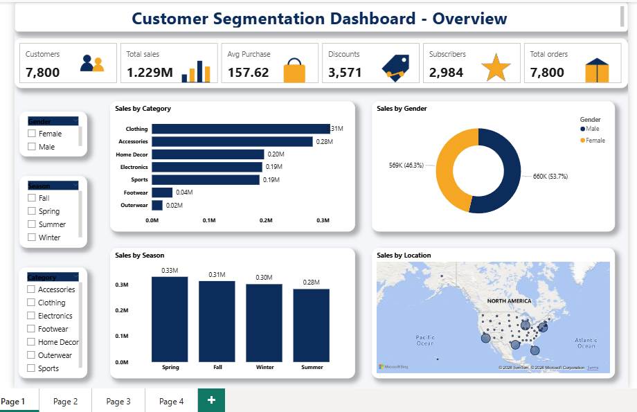
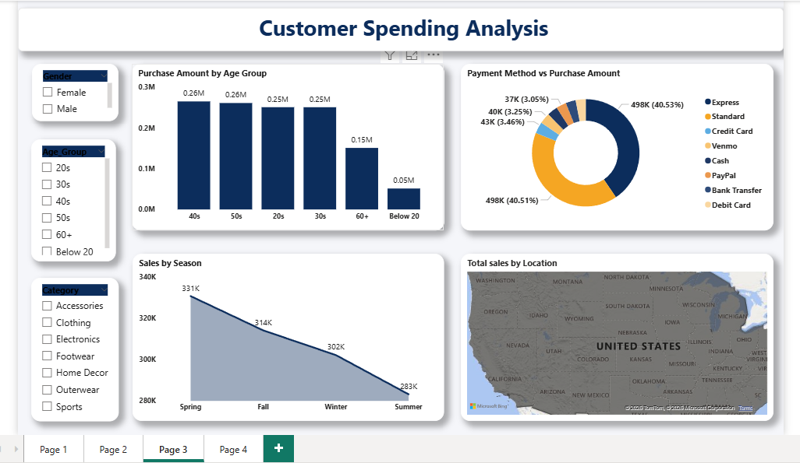
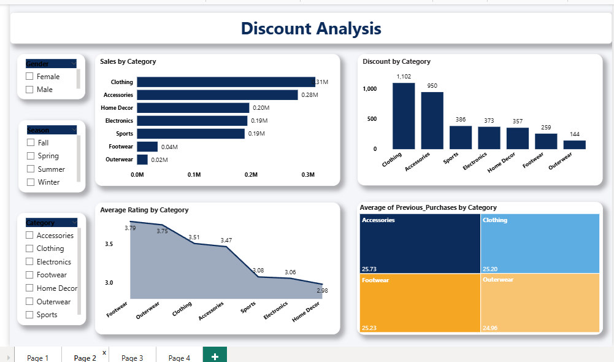
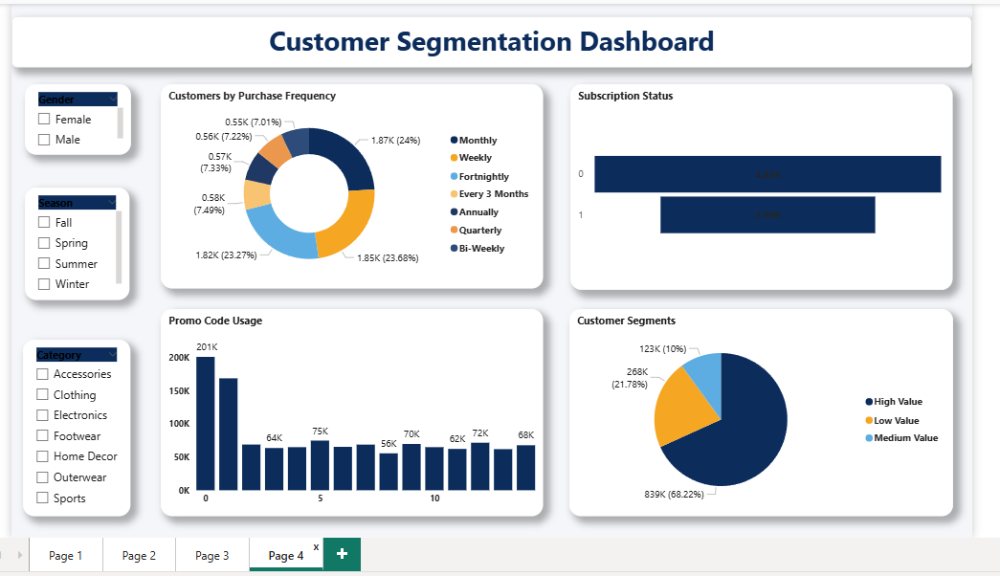

# Customer Segmentation Analysis

## Project Overview

This project analyzes 7,800 US retail customer transactions to identify purchasing patterns, spending behavior, and customer segments for targeted marketing decisions.

## Tools Used

- Power BI
- Python
- KMeans Clustering
- MySQL
- Power Query

## Dataset

- 7,800 US shoppers
- Customer demographics
- Product categories
- Purchase amount
- Location
- Season
- Review rating
- Discount status
- Payment method
- Purchase frequency

## Analysis Performed

- Discount Analysis
- Age, Season & Spending Analysis
- Customer Segmentation using KMeans
- Product Category Analysis
- Customer Value Analysis
- Marketing Recommendation Analysis

## Key Insights

- Clothing and Accessories are the top-selling categories.
- Customers aged 20–50 contribute the majority of revenue.
- Spring is the strongest sales season.
- 68.2% of customers are classified as High Value.
- Footwear and Outerwear have high ratings but relatively low sales and discount activity.

## Customer Segments

- High Value – 68.2%
- Medium Value – 10.0%
- Low Value – 21.8%

## Methodology

Data was cleaned and de-duplicated using Power Query. Customer segmentation was performed using Python KMeans clustering based on spending behavior. The cluster output was merged with the main dataset using Customer ID and analyzed through an interactive 4-page Power BI dashboard.

## Power BI Dashboards

### 1. Overview Dashboard

### 2. Customer Spending Analysis

### 3. Discount Analysis

### 4. Customer Segmentation Dashboard

